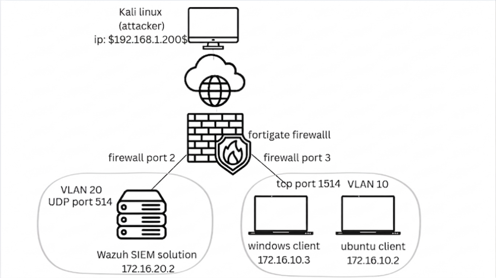
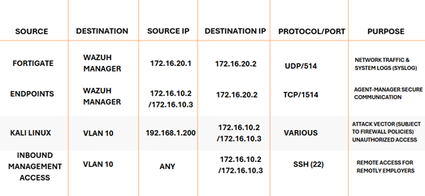
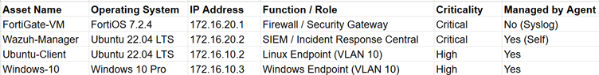
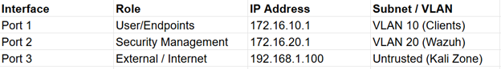
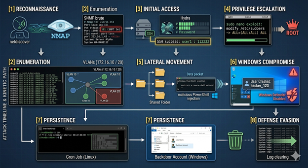
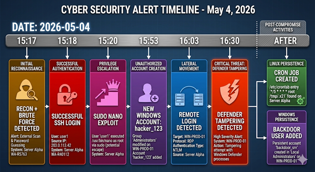

# End-to-End SOC Investigation & Incident Response Lab
### NIST SP 800-61 & MITRE ATT&CK Mapping

##  Project Overview
This project demonstrates a complete Security Operations Center (SOC) lifecycle, from infrastructure design and attack simulation to detection and incident recovery. Developed as a graduation project for the **Digital Egypt Pioneers Initiative (DEPI)**, it showcases the integration of enterprise-grade security tools to defend against modern cyber threats.

The project simulates a multi-stage attack involving reconnaissance, initial access via brute force, privilege escalation, and lateral movement, followed by a structured response aligned with the **NIST Incident Response Framework**.

---

##  Architecture & Topology
The environment is built on **VMware Workstation** with a segmented network architecture managed by a **FortiGate NGFW**.

* **Security Gateway:** FortiGate Next-Generation Firewall (v7.2.4)
* **SIEM Platform:** Wazuh Manager 
* **Endpoints:** * Ubuntu 22.04 (Target & Syslog source)
    * Windows 10 Pro (Target with Wazuh Agent)
* **Attacker Node:** Kali Linux
* **Networking:** Segmented VLANs (VLAN 10 for Endpoints, VLAN 20 for SIEM Management) with static routing and NAT policies.

##  Project Visuals & Infrastructure

### Network Low Level Diagram (LLD)

*Detailed view of the segmented VMware environment and FortiGate routing.*

### Traffic Flow & Communication Matrix

*Mapping of allowed services (SSH, Syslog, Wazuh Agent) across VLAN boundaries.*

### Asset Inventory

*Endpoint classification including Ubuntu 22.04, Windows 10, and the Wazuh Manager.*

### Detailed FortiGate Interface Inventory


---

## Cyber Attack Visualization

### Attack Flow Diagram (Kill Chain)

*Visualization of the attack path from external reconnaissance to lateral movement.*

### Attack Timeline Visualization

*A chronological mapping of attacker actions vs. SIEM detection alerts.*

---

##  Attack Scenario & MITRE Mapping
The simulation follows a realistic attack path, mapping every action to the **MITRE ATT&CK** framework:

1.  **Reconnaissance (T1592/T1046):** Exploiting weak SNMP configurations on the FortiGate to leak internal routing tables and network topology.
2.  **Initial Access (T1110.001):** SSH Brute Force using **Hydra** against the Ubuntu endpoint.
3.  **Privilege Escalation (T1548.003):** Exploiting a `sudo nano` misconfiguration (GTFOBins) to gain root access.
4.  **Persistence (T1136.001):** Creating a hidden administrative user on Windows and scheduling cron jobs on Linux.
5.  **Lateral Movement (T1021.002):** Pivoting from the Linux host to the Windows client via shared network directories.

---

##  Defense & Incident Response
### 1. Detection & Analysis
Using the **Wazuh SIEM**, specific alerts were triggered and analyzed:
* **Rule 5712:** Detected SSHD authentication failure (Brute Force).
* **Rule 5402:** Detected successful `sudo` execution for unauthorized binaries.
* **Syslog Monitoring:** FortiGate logs captured the SNMP reconnaissance attempts.

### 2. Incident Response Playbooks
This repository includes detailed **NIST-aligned playbooks** developed during the project:
* **[Playbook: SSH Brute Force](./playbooks/ssh_brute_force.md):** Focuses on identification and automated blocking via Wazuh Active Response.
* **[Playbook: Privilege Escalation](./playbooks/priv_esc.md):** Detection of unauthorized `sudo` usage and session termination.
* **[Playbook: Network Scanning](./playbooks/net_scan.md):** Handling reconnaissance alerts and firewall policy hardening.

---

##  Key Skills Demonstrated
* **Security Operations:** Wazuh SIEM deployment, log correlation, and alert tuning.
* **Network Security:** FortiGate NGFW administration, VLAN tagging, and firewall policy creation.
* **Blue Teaming:** Threat hunting, root cause analysis, and environment hardening.
* **Framework Implementation:** NIST SP 800-61 (Incident Handling) and MITRE ATT&CK mapping.
* **Scripting:** Automation of containment steps using Bash and Python.

---

##  Repository Structure
```
├── assets/                 # Architecture diagrams and Wazuh dashboard screenshots
├── documentation/          # Full Technical Project Documentation (PDF)
├── playbooks/              # NIST-mapped IR Playbooks
├── scripts/                # Custom detection rules and hardening scripts
└── README.md
